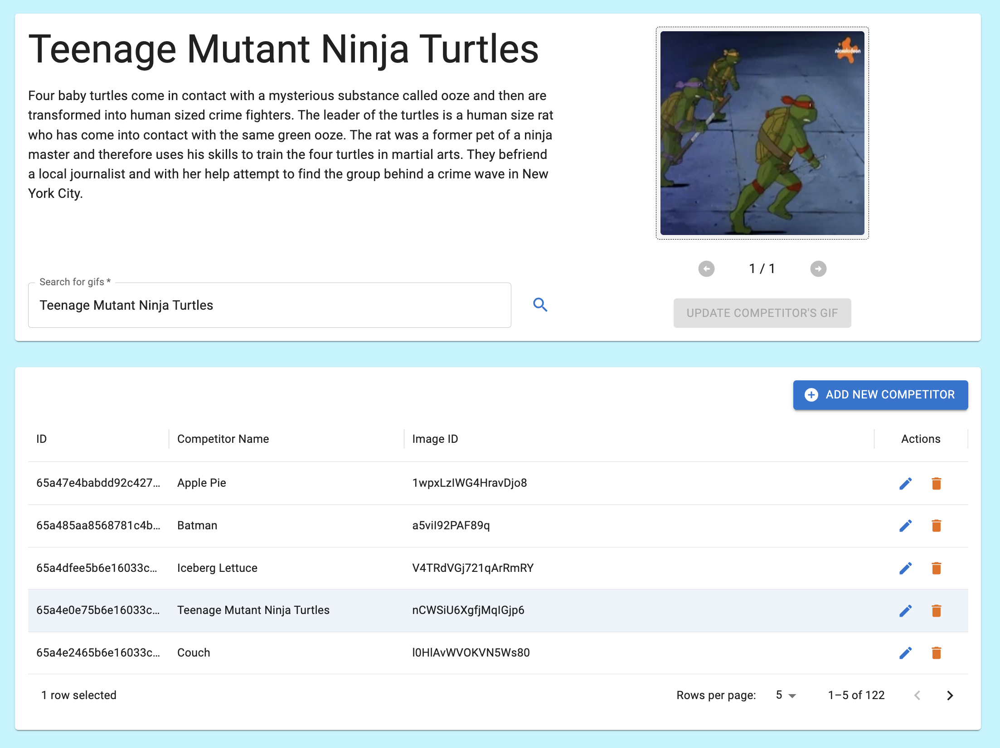

# This or That Admin Interface

A management interface built for overseeing the [This or That](https://this-or-that.app/competition) application, handling competitor data, competition state, and AI-driven workflows. It exposes internal tools, streaming AI endpoints, and operational insights used during development and administration.

> While the interface is visible for demonstration purposes, the admin and backend services themselves are not publicly available.

# Features

### Dashboard

The dashboard provides a consolidated view of real-time application activity, including:

- Current competition status
- Behavioral metrics (vote patterns, active competitor count, etc.)
- New competitor additions
- Quick actions and alerts

Its purpose is to surface the system’s overall health at a glance.


### Competitor Management

Here, admins can create, update, deactivate, and inspect competitors.

- All competitor data is editable.
- _Deletion_ is implemented as a soft delete to preserve data history.
- Bulk operations allow efficient competitor creation.

AI-assisted flows are integrated directly into the interface:

- Streamed description generation during competitor creation/modification
- Bulk competitor generation (names & descriptions) to reduce manual work



# AI-Assisted Workflows

> No one wants to get lost in 20+ lines of route code, so all of the snippets are simplified or stripped down to showcase the flow.

The admin interface integrates with OpenAI’s Assistants API to generate structured competitor content and streamline bulk creation. All AI calls are made on the backend, so the frontend never touches the OpenAI API.

These workflows help reduce manual effort and make competitor generation faster and more consistent.

There are two main AI workflows:

1. Streaming descriptions for a single competitor
2. Batch generation of multiple competitors with fuzzy matching against existing data

### Streaming Single Competitor Descriptions

When an admin wants help writing or refining a competitor description, the backend uses a streaming run against the Describer assistant:

```js
// Resolve Describer thread
const thread = await resolveThread('Describer');

// Send the competitor's name
await openai.beta.threads.messages.create(thread.id, {
    role: 'user',
    content: value,
});

// Start a streaming run for the Describer assistant.
return openai.beta.threads.runs.stream(thread.id, {
    assistant_id: DESCRIBER_ID,
});

// The route layer then writes the stream back to the client.
```

This keeps the experience responsive and lets the user see the description form in real time instead of waiting for a single blocking response.


### Bulk Competitor Generation

Bulk generation uses a separate Generator assistant and a structured, multi-step pipeline:

```js
const totalSteps = 2;

// Step 0 – initialization
streamStep({ step: 0, totalSteps });

// Step 1 – call OpenAI and get raw generated competitors
const rawCompetitorOutput = await runCompetitorGeneration(value);
streamStep({ step: 1, totalSteps });

// Step 2 – parse and enrich with fuzzy matching
const enrichedCompetitors = await fuzzySearchCompetitors(rawCompetitorOutput);

streamStep({ step: 2, totalSteps, data: enrichedCompetitors });
```

What’s happening under the hood:

#### Streaming Progress Updates

The bulk generation pipeline sends progress back to the client as a stream of JSON chunks. The frontend listens to this stream and updates progress using `{ step, totalSteps }` values as they arrive:

- step 0: Initializing / contacting AI
- step 1: AI response received; running fuzzy matching
- step 2: Final enriched competitor payload

This avoids a long blocking request and gives the admin real-time feedback as the server moves through each stage.

#### AI generation via Generator assistant

```js
const numberOfCompetitors = 5;

// Resolve Generator thread
const thread = await resolveThread('Generator');

// Send the number of competitors requested
await openai.beta.threads.messages.create(thread.id, {
    role: 'user',
    content: numberOfCompetitors,
});

// Start the assistant run
const run = await openai.beta.threads.runs.createAndPoll(thread.id, {
    assistant_id: process.env.OPENAI_ASSISTANT_ID_GENERATOR,
});

// Once the run has completed, find and return the value
if (run.status === 'completed') {
    const messages = await openai.beta.threads.messages.list(thread.id);
    return messages.data.find((msg) => msg.run_id === run.id);
}
```

#### Fuzzy matching against existing competitors

To avoid unintentionally re-creating very similar competitors, the backend runs a quick fuzzy search for each AI-generated name:

```js
return Competitor.aggregate([{ $search: { text: { query: name, path: 'name' } } }, { $limit: 1 }]);
```

- This uses MongoDB’s $search stage to find close matches on the name field.
- The best match (if any) is attached as matchedCompetitor.
- The final payload includes both the AI-generated competitor and any likely existing match, so the admin can decide whether to create or discard new competitors.

This results in a clear multi-step flow:

1. Ask AI for N competitors.
2. Enrich the raw AI output by checking whether similar competitors already exist.
3. Stream progress & results back to the UI.


### Thread Management & Expiration

To keep some conversational context without rebuilding prompts from scratch, the backend maintains one thread per assistant type (currently Describer and Generator).

A Thread document is stored in our DB with the OpenAI `threadId` and `assistantType`, for example:

```js
const Thread = new Schema(
    {
        threadId: { type: String, required: true },
        assistantType: {
            type: String,
            enum: ['Describer', 'Generator'],
            required: true,
        },
    },
    { timestamps: true, expireAfterSeconds: 2592000 }, // ~30 days
);
```

- expireAfterSeconds: 2592000 (~30 days) means MongoDB automatically cleans up old thread documents.
- When a document expires, its associated OpenAI thread is no longer referenced by the app.

On each AI call, the backend:

1. Looks up an existing Thread for the given assistantType.
2. If none exists (or the old one has expired and been removed), it creates a new OpenAI thread and saves it.
3. Retrieves that thread from OpenAI and appends a new user message before kicking off a run.

A simplified version of the helper function looks like:

```js
async function resolveThread(type) {
    const existing = await Thread.findOne({ type });
    return existing ?? createNewThread(type);
}
```

This keeps the context for each assistant type reasonably fresh while MongoDB handles automatic cleanup.

## Libraries

- OpenAI API
- TanStack Query & Router
- GIPHY API
- Material UI
- MUI X Charts

Material UI and MUI X Charts provide a fast path to building polished dashboards. TanStack Query provides solid mutation handling and caching mechanics, keeping the admin UI responsive.

Working with the OpenAI API is more involved. Validating structured outputs, interpreting assistant thread responses, managing streaming, and handling model quirks requires additional backend logic. But once the architecture is in place, the setup is absolutely worth it.

TanStack Router offers excellent type-safety and composability, and its developer experience pairs naturally with TanStack Query. Together they make the admin interface feel stable and predictable.
