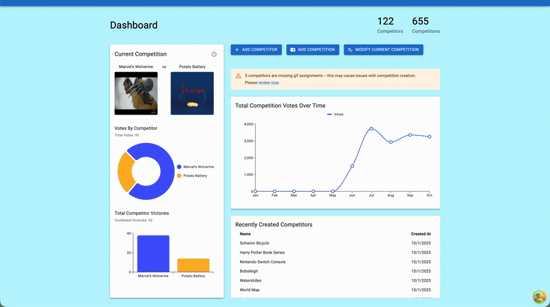
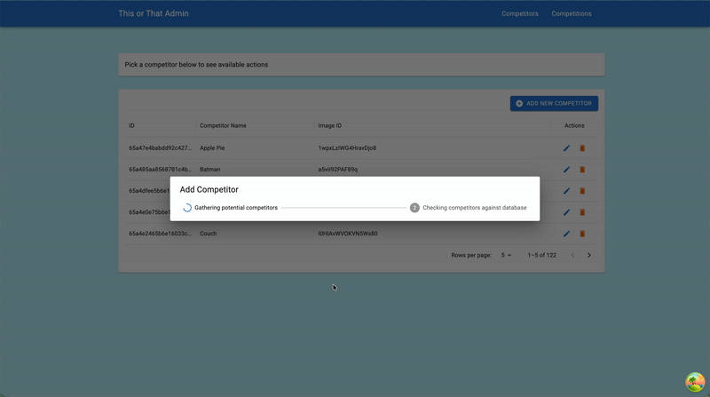
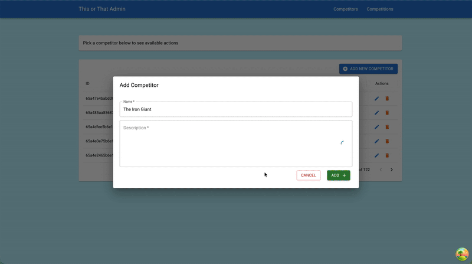

# This or That Admin Interface

An admin tool for interacting with the backend for [This or That](https://this-or-that.app/competition).

> **Note:** The admin tool and backend are not currently available to the public. This admin tool is intended for internal use while visibility is for demonstration purposes only. You can of course fork or download the source as you see fit.

## Features

### Dashboard

The dashboard provides a centralized overview of key metrics and recent activity within the admin interface. It displays the current competition, summaries on competition behaviors, and recent competitor additions. It also provides quick access to common actions.

The goal of the dashboard interface is to provide a snapshot of the application.

### Competitor Management

The Competitor Management module allows an admin to perform operations on competitors.

All competitors can be viewed, modified, and deleted. The deletion operation currently only deactivates competitors to maintain data integrity.

During creation and modifications, there are several AI interactions available.

- Stream new competitor descriptions during manual addition or modification removing the need to write your own.
- Generate a list of new competitors and description allowing the user to streamline bulk creations.

### More on AI Interactions

As mentioned, the admin interface exposes several interactions with OpenAI to assist in new competitor generation.

All AI computations are done on the backend and streamed (where applicable) to the frontend.

We utilize custom assistants via the OpenAI API. Conversation threads are created and saved to our database to improve context retention and reduce duplicative generations. Threads do have an expiration date, on that expiration new threads are created and saved.

## Libraries

- OpenAI API
- TanStack Query
- TanStack Router
- GIPHY API
- Material UI
- MUI X Charts

### Notes on Libraries

Material UI and MUI X Charts offer a straightforward and developer-friendly experience, especially for building interactive charts and UI components.

In contrast, integrating with the OpenAI API can be more complex. Accessing the correct attributes and parsing the returned data often requires additional handling and careful attention to API responses. There was much trial and error in getting that to work. From a preformance perspective, there is much to be desired but most gains would be integrating a more robust system.

TanStack Query excels at caching and provides smooth UI updates during mutations, reducing the need for manual state management. TanStack Router is a robust alternative to React Router, offering type safety and a comprehensive feature set, including file-based routing for scalable navigation structures. Hard for me to find issue when working with Tanstack's ecosytem.
